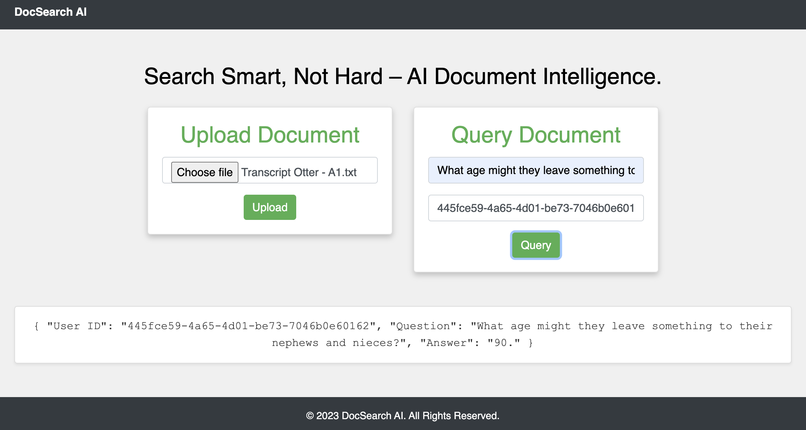
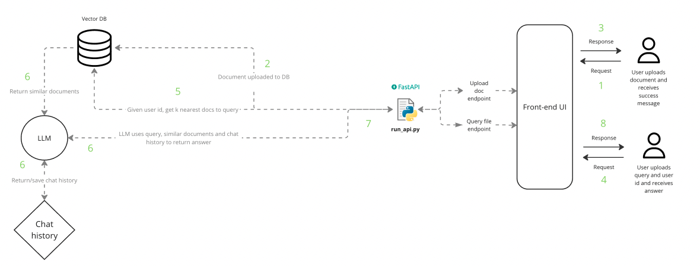

# Upload & Query Document using AI

<p align="center">
  
</p>

## What is this repository about?

This repository contains code which allows the end user to upload a document to a vector database and query the document using a Large Language Model (LLM). A LLM is a type of machine learning model that can perform a variety of natural language processing (NLP) tasks such as answering questions in a conversational manner.

The project architecture follows the Retrieval Augmented Generation (RAG) framework. This allows the LLM to retrieve facts from an external knowledge base to ground LLMs on the most accurate, up-to-date information.

<p align="center">
  
</p>


## Key tools used
- Python: Langchain, Hugging Face Transformers, Sentence Transformers, FAISS, FastAPI
- Docker

## How to use?

I am using a 2021 MacBook Pro M1 chip

**To run locally:**
```
cd qa-app
make init
make get-files
make run-api
```

Go to `http://0.0.0.0:8000/` and test.

**To run using docker:**

Open dockerhub

```
cd qa-app
make docker-build
make docker-run
```
Go to `http://0.0.0.0:8000/` and test.


## Notes

- The default model is `google/flan-t5-base` as it is quick and light weight. However, for better performance update the `parameters.yaml` file with a model like `google/flan-t5-xl` or another from the [text2text-generation](https://huggingface.co/models?sort=trending) models on hugging face. Langchain also supports `text-generation` models. To use these you will need to update the code in `model_utils.py` and `rag_utils.py`.


## Future work
- Gradio app
- Automatically clear database
- Add citations:
    - https://github.com/langchain-ai/langchain/blob/master/cookbook/qa_citations.ipynb
    - https://python.langchain.com/cookbook
